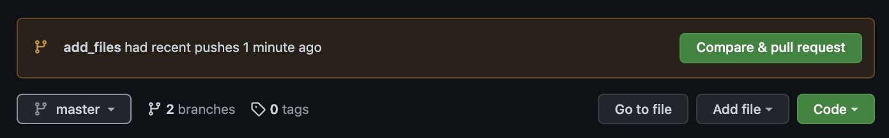
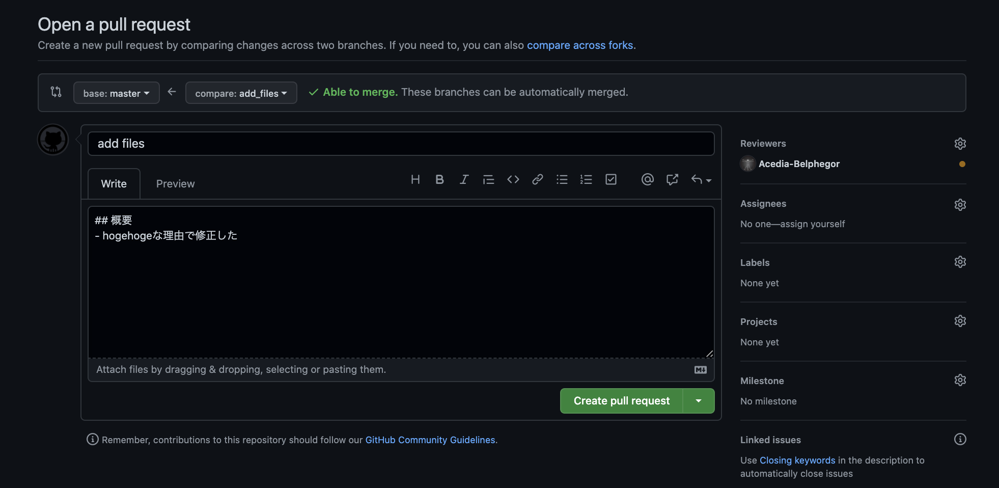
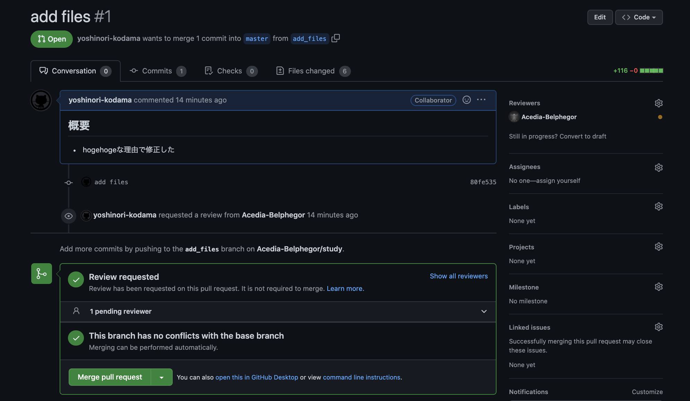
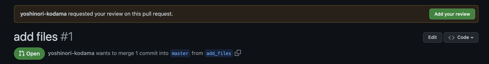

# pull request

リモートリポジトリにpushする（今回の例では `add_files` というブランチ名で）
```
$ git push origin add_files:add_files
Enter passphrase for key '/Users/yoshinori.kodama/.ssh/id_rsa': 
Enumerating objects: 10, done.
Counting objects: 100% (10/10), done.
Delta compression using up to 4 threads
Compressing objects: 100% (8/8), done.
Writing objects: 100% (9/9), 2.03 KiB | 693.00 KiB/s, done.
Total 9 (delta 0), reused 0 (delta 0), pack-reused 0
remote: 
remote: Create a pull request for 'add_files' on GitHub by visiting:
remote:      https://github.com/Acedia-Belphegor/study/pull/new/add_files
remote: 
To github.com:Acedia-Belphegor/study.git
 * [new branch]      add_files -> add_files
```

GitHubにログインすると `Compare & pull request` というボタンが表示されるのでクリックする
  

pull request を作成する
  

memo
- `base:<ブランチ名>` にマージして欲しいリモートブランチを設定する
  - 一般的な運用ではリリース用のブランチが存在しており、masterやdevelopに直接マージすることは少ない
- Reviewersを設定する
- コメント本文を記述する

`Create pull request` をクリックすると登録される
  


## pull requestをレビューする

Reviewersに設定されたユーザーがログインして該当のPRを開くと、右上に `Add your review` ボタンが表示されるのでクリックする
  

参考
- https://howpon.com/6351

